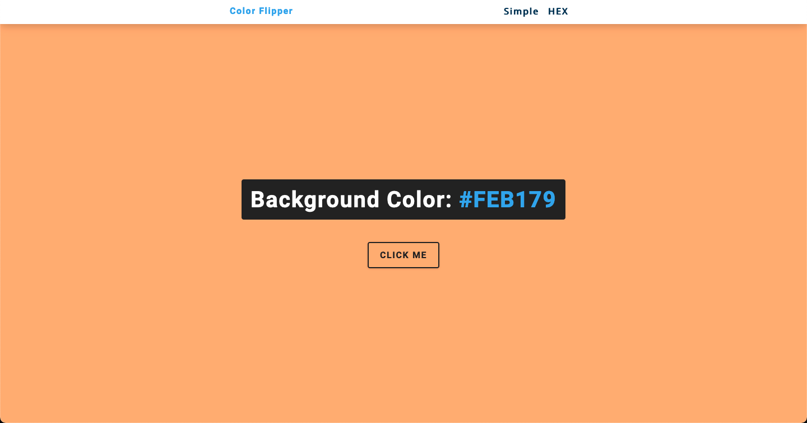

# Color Picker

In this project I have created landing page that chooses random colors on the fly.

## Table of contents

- [Overview](#overview)
  - [Screenshot](#screenshot)
  - [Links](#links)
- [My process](#my-process)
  - [Built with](#built-with)
- [Author](#author)

## Overview

### Screenshot

### Links

- Live Site URL: [Color Picker](https://zoxabbasi.github.io/color-picker/)

## My process

- Using CSS to style the page.
- Using Javascript for add functionality.

### Built with

- Semantic HTML5 markup
- CSS custom properties
- JavaScript to get random colors

## Author

- Website - [Talal Abbasi](https://zoxabbasi.github.io/)
- Twitter - [@zoxabbasi](https://www.twitter.com/zoxabbasi)
